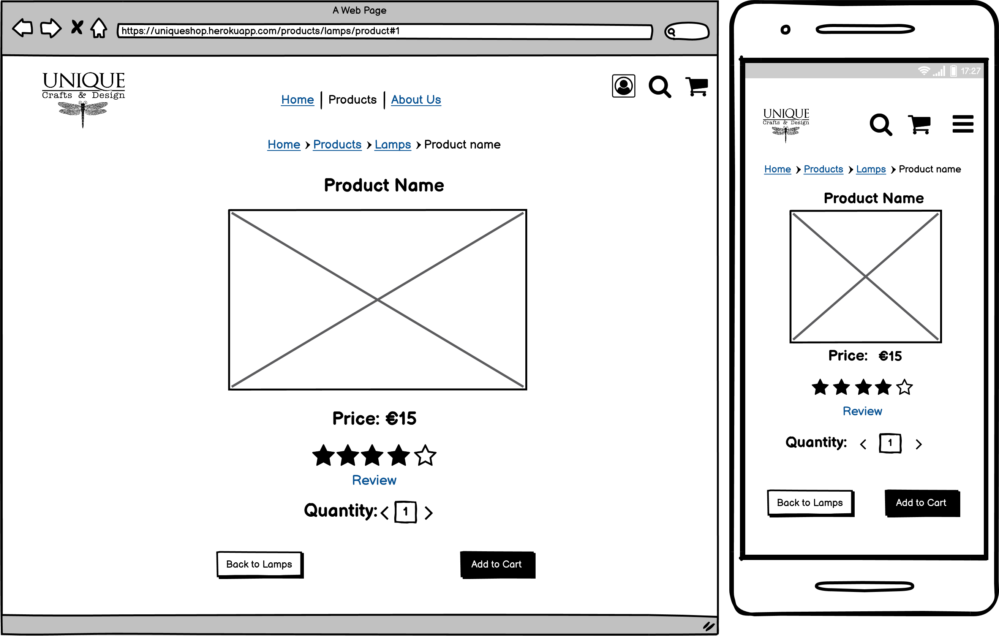

# Unique Shop

This project is an e-commerce website created for Milestone Project 4("Code Institute").

UNIQUE Crafts & Design is a shop selling handcrafted items. Located in Geroge's Street Arcade in Dublin city centre.

:globe_with_meridians:[Live website](https://mn-unique-shop.herokuapp.com/)

:page_facing_up:[GitHub repository](https://github.com/mateuszniechwiej/unique_shop)

# Table of Contest

- [UX](#ux)

  - [The Strategy Plane](#the-strategy-plane)

    - [Project Goal](#project-goal)

    - [Site Goals](#site-goals)

    - [User Stories](#user-stories)

  - [The Scope Plane](#the-scope-plane)

    - [Planed Features](#planed-features)

  - [The Structure Plane](#the-structure-plane)

  - [The Skeleton Plane](#the-skeleton-plane)

    - [Wireframes](#wireframes)

  - [The Surface Plane](#the-surface-plane)

  - [Design](#design)

    - [Colour Scheme](#colour-scheme)

    - [Typography](#typography)

    - [Database Architecture](#database-architecture)

    - [Imagery](#imagery)

    - [Differences to design](#differences-to-design)

- [Features](#features)

  - [Existing Features](#existing-features)

  - [Future Features](#future-features)

- [Technologies Used](#technologies-used)

  - [Languages Used](#languages-used)

  - [Frameworks, Programmes and Libraries](#frameworks-programmes-and-libraries)

- [Testing](#testing)

- [Deployment](#deployment)

  - [Project Initiation](#project-initiation)

  - [Heroku Deployment](#heroku-deployment)

  - [Run Locally](#run-locally)

- [Credits](#credits)

  - [Code](#code)

  - [Acknowledgements](#acknowledgements)

# UX

## The Strategy Plane

### _Project Goal_

The unique shop is a full-stack e-commerce web application for a handmade craft shop in Dublin.

Customers will be able to purchase items offered by the shop. Registered users will be able to save and update information and receive a discount voucher to use at the checkout.

The aim is to build a responsive e-commerce 

### _Site Goals_

- To provide users with a simple and easily navigated website.

- To sell the products the shop has to offer.

- To offer secure online payment for shoppers.

### _User Stories_

1. As a user, I want to understand the purpose of this website.

2. As a user, I want to find an easily navigated website and find all the content.

3. As a user, I want the website to be responsive and allow me to use it comfortably on all size devices(particularly mobiles phones).

4. As a user, I want to find a clear and easy registration on the website.

5. As a user, I want to receive an email confirmation upon registering.

6. As a user, I want to be able to log in/log out to/from my account.

7. As a user, I want to control my account information and have the option to update my profile details and delete the account.

8. As a user, I want to view individual product information and be able to review that item.

9. As a user, I want to view the total of my purchases and the final cost including delivery.

10. As a user, I want to have products grouped into categories.

11. As a user, I want to be able to search for the products I'm interested in.

12. As a user, I want to select the number of products I'm buying.

13. As a user, I want to be able to contact the site owner for any questions or suggestions I might have.

## The Scope Plane

### _Planed Features_

 1. Users can register.

 2. Allow admin and users to log in.

 3. Allow users to purchase items online.

 4. Allow users to review shop products.

 5. Display users profiles.

 6. Display Users orders.

 7. Search product functionality.

 8. Add and redeem a voucher for users.

 9. Use SQLite database to store information

 10. Responsive website with a navigation menu and website title.

| -   | Planed Feature                                                     | Importance | Viability/Feasibility |

| --- | ------------------------------------------------------------------ | ---------- | --------------------- |

| 1   | Users able to register                                             | 5          | 3                     |

| 2   | Allow admin and users to login                                     | 5          | 3                     | 

| 3   |  Allow user to purches items online     | 5          | 5                     | 

| 4   | Allow user to review shop products            | 4          | 5                     |

| 5   | Display Users profile                                              | 4          | 4                     |

| 6   | Display Users orders                         | 4          | 4                     |

| 7   | Search product functionality                 | 4          | 3                     |

| 8   | Add and reedem voucher for users  | 3          | 5                     |

| 9   | Use SQLite database to store information  | 5          | 4                     |

| 10  | Responsive website with a navigation menu and website title        | 5          | 2                     |

## The Structure Plane

### _Addresing users stories_

> As a user, I want to understand the purpose of this website.

A solution to satisfy user requirements:

- Shop logo in the navigation bar.

- Categories and product links in the header.

- Image carousel showing the main products this shop has to offer.

- Additional information in the footer includes about section, social links etc.

> As a user, I want to find an easily navigated website and find all the content.

A solution to satisfy user requirements:

- Top navigation menu in the Header displays Home, Login, and Registration links.

- Footer at the bottom of the page.

> As a user, I want the website to be responsive and allow me to use it comfortably on all size devices(particularly mobiles phones).

A solution to satisfy user requirements:

- Bootstrap 5 will be used for this website to ensure all content is displayed correctly.

- Collapsible menu when using the website on mobile phones.

> As a user, I want to be able to register to the website. 

A solution to satisfy user requirements:

- registration link is available in the navigation bar.

- link to redirect to registration when on the login page.

> As a user, I want to receive an email confirmation upon registering.

A solution to satisfy user requirements:

- confirmation email will be sent once the registration form will be submitted.

> As a user, I want to be able to log in/log out to/from my account.

A solution to satisfy user requirements:

- log in/out links available in the navigation bar menu.

- log in to the link also available on the registration page if the user has already an account.

> As a user, I want to control my account information and have the option to update my profile details and delete the account.

A solution to satisfy user requirements:

- edit and delete buttons available on the account profile page once a user logged in.

> As a user, I want to view individual product information and be able to review that item.

A solution to satisfy user requirements:

- once clicked on the product image, the user will be redirected to a product details page.

- all products can be reviewed once on the product detail page.

> As a user, I want to view the total of my purchases and the final cost including delivery

A solution to satisfy user requirements:

- After adding each item the current total will be visible in the modal.

- information about the total price for items will be available in the shopping cart.

- final cost including shipping fees available at the secure checkout before making the payment.

> As a user, I want to have products grouped in categories.

A solution to satisfy user requirements:

- in the navigation menu user can find categories and all product links.

> As a user, I want to be able to search for the products I'm interested in.

A solution to satisfy user requirements:

- search bar was introduced to allow the user to search by categories and product description.

> As a user, I want to select the number of products I'm buying.

A solution to satisfy user requirements:

- users can select the quantity of each item on the product page.

- in the shopping cart user can update the quantity of each product or delete it from the basket.

> As a user, I want to be able to contact the site owner for any questions or suggestions I might have.

A solution to satisfy user requirements:

- contact information in the footer including shop address.

- social links are provided where the user can contact the shop owners.

## The Skeleton Plane

### _Wireframes_

Home

Login

About Us

Account Details

Account Order

Order

Cart

Checkout

Product Details

Register

Review

## The Surface Plane

### Design

#### Colour Scheme

#### Typography

:black_nib:

Fonts used in this project are:

'__Spirax__' with *cursive* as a fallback font to give headlines a refined and interesting look is paired with a simple neutral  '__Open Sans Condensed__' with '*sans-serif*' as a fallback.

This combination works well with this shop selling uniquely designed handmade products.

### Database Architecture

A relational database is used in this project as the best solution for an e-commerce website. In the development process, SQLite was used. Heroku Postgres was used in production:

### Imagery

All images used in this project were supplied by the Unique Shop owner.

### Differences to design:

There are several changes to the original design:

1. Not including voucher coupons for registered users due to lack of time.

2. Not including model variants to change the price based on product size as that implementation become too expensive in terms of resources.

3. Home page design changed to not overload users with too much content.

4. Adding contact form for users and allowing sending emails to site admin.

5. Not Including About Us page (moving some information to contact page)

6. Not including login and registration pages and use allauth templates.

7. Change approach for a product review :

  * Allow users to add comment

  * Not include star rating(instead 1-5 points scale)

8. Not including google maps due to concept change during the development process.

## Features

### Existing Features

1. Mobile responsive design.

 - toasts messages

 - navbar

 - back top button

 - image carousel

 - cards

 - forms

2. Register and login functionality.

3. Profile page with email, order history and user address details for shipping.

4. Error pages 404 and 500

5. "__Stripe__" payments for customers

6. Review products 

7. Django multi-select allowing admin to add relevant colour for each product

8. Search functionality

9. Sorting functionality for price and category

10. Cloudinary for storing media files

11. AWS3 to host static files 

### Future Features

1. Admin Tool to add/delete the product and read messages from the user.

2. Average rating display and sorting reviews from highest rated.

3. Voucher cupon model to allow registered users to get discounts.

4. Add product variants to get the price depending on the size of the product.

5. Displaying more images for the product on the product details page

6. Pagination

7. Address google map

8. Shipping rates based on country 

9. Company footer

## Technologies Used

### Languages Used

* [HTML5](https://en.wikipedia.org/wiki/HTML5)

* [CSS3](https://en.wikipedia.org/wiki/CSS)

* [JavaScript](https://pl.wikipedia.org/wiki/JavaScript)

* [Python](https://www.python.org/) -

  

  
python modules used in this project:

    * appdirs==1.4.4

    * asgiref==3.4.1

    * Babel==2.9.1

    * boto3==1.19.2

    *  botocore==1.22.2

    *  certifi==2021.5.30

    *  cffi==1.14.6

    *  charset-normalizer==2.0.6

    *  cloudinary==1.26.0

    *  crispy-bootstrap5==0.6

    *  cryptography==3.4.8

    *  defusedxml==0.7.1

    *  distlib==0.3.1

    *  dj-database-url==0.5.0

    *  Django==3.2.7

    *  django-allauth==0.45.0

    *  django-cleanup==5.2.0

    *  django-cloudinary-storage==0.3.0

    *  django-colorfield==0.4.5

    *  django-countries==7.2.1

    *  django-crispy-forms==1.13.0

    *  django-dotenv==1.4.2

    *  django-multipleselectfield==0.2.0.post2

    *  django-multiselectfield==0.1.12

    *  django-storages==1.12.2

    *  filelock==3.0.12

    *  gunicorn==20.1.0

    *  idna==3.2

    *  jmespath==0.10.0

    *  oauthlib==3.1.1

    *  Pillow==8.3.2

    *  psycopg2-binary==2.9.1

    *  py-moneyed==1.2

    *  pycparser==2.20

    *  PyJWT==2.1.0

    *  python-dateutil==2.8.2

    *  python-decouple==3.5

    *  python3-openid==3.2.0

    *  pytz==2021.1

    *  requests==2.26.0

    *  requests-oauthlib==1.3.0

    *  s3transfer==0.5.0

    *  six==1.15.0

    *  sqlparse==0.4.2

    *  stripe==2.61.0

    *  urllib3==1.26.7

    *  virtualenv==20.4.4

    

## Frameworks, Programmes and Libraries

* [jQuery](https://jquery.com/) - used for toast messages,increment/decrement functionality , Stripe payments, hamburger toggler, back to top button and preventing form from re-submission reviews.

* [Django](https://www.djangoproject.com/) framework was used to build this site.

* [Bootstrap 5](https://getbootstrap.com) - 

    used for layouts, styling and custom components

* [JIRA](https://www.atlassian.com/software/jira) - project management tool to organize workflow.

* [Balsamiq](https://balsamiq.com/) - to create wireframes

* [techsini](https://techsini.com/) - to generate website mock-up.

* [dbdiagram](https://dbdiagram.io/) - to create data base diagram.

* [PostgreSQL](https://www.postgresql.org/)

    * DB used after deploying to Heroku

* [Google Fonts](https://fonts.google.com/) - to import fonts for this site

* [JPEG-OPTIMIZER](http://jpeg-optimizer.com/) - to optimize some images used in this project.

* [Font Awesome](https://fontawesome.com/) - for social media links and forms icons.

* [Heroku](https://heroku.com) - Heroku was to deploy and host the live website.

* [AWS](https://aws.amazon.com/free/) - AWS S3 Bucket was set up to store static files.

* [Visual Studio Code](https://code.visualstudio.com/) - used for developing this website and committing the project to GitHub repository.

* [Chrome Developer Tools](https://developers.google.com/web/tools/chrome-devtools) - used to debug the styling issues, test the website responsiveness and make sure colour contrast is correct.

* [Github](https://github.com/) - Github as the hosting site was used to store the source code of this website.

* [Git](https://git-scm.com/) - used Git to commit and push code to the GitHub repository.

* [Favicon](https://favicon.io/) - to create a favicon for this Website.

* [Wave](https://wave.webaim.org/) - web accessibility evaluation tool

* [Lighthouse](https://developers.google.com/web/tools/lighthouse) - as a part of the chrome dev tool was used to improve the quality of the web page.

## Testing

:point_right: [TESTING](TESTING.md)

## Deployment

### Project Initiation

1. Navigating to the GitHub [Repository](https://github.com/mateuszniechwiej/unique_shop/)

2. Click on Code green button.

3. Under the Clone section, copy the URL from the HTTPS : 

4. Use the IDE of choice(vscode in my case) to open the terminal.

5. Use the git clone command followed by the copied URL.

6. A clone of the project will now be created locally on your machine.

### Heroku Deployment

* Create Application

  1. Create a Heroku account.

  2. Press the `New` button. 

  2. Select `Create a new app`.

  3. Enter the app name.

  4. Select region.

 * Create connection to Github Repository

   1. Click the deploy tab and select GitHub - `Connect to GitHub`.

   2. field to find a GitHub repository to connect to will then be displayed.

   3. type repository name in that input field 

   4. once the repo is founded, click the connect button.

  * PostgresSQL Database

   1. Click the `resources` tab

   2. Under Add-ons search for Heroku Postgres and then click on it when it appears.

   3. Select Plan name Hobby Dev - Free and then click Submit Order Form.

  * Setting environment variables 

   1. Click on the settings tab and then click reveal config vars.

   2. Variables added for this project: 

    * AWS_ACCESS_KEY_ID

    * AWS_SECRET_ACCESS_KEY

    * DATABASE_URL

    * EMAIL_HOST_PASS

    * EMAIL_HOST_USER

    * SECRET_KEY

    * STRIPE_PUBLIC_KEY

    * STRIPE_SECRET_KEY

    * STRIPE_WEBHOOK_SECRET

    * USE_AWS

  * Enable automatic deployment:

   * Click the Deploy tab

   * In the `Automatic deploys section`, the select branch you want to deploy from then click `Enable Automation Deploy`

### Run Locally

1. Navigating to the GitHub [Repository](https://github.com/mateuszniechwiej/uni)

2. Click on Code green button.

3. Under the Clone section, copy the URL from the HTTPS 

5. Use the IDE of choice to open the terminal.

6. Use git clone command followed by the copied URL.7. A clone of the project will now be created locally on your machine.

## Credits

[codepen](https://codepen.io/michalwyrwa/pen/GBaPPj) - used this code and customized it for this site

[codepen](https://codepen.io/designcouch/pen/Atyop) - used this code and customized it to create a hamburger toggler in the navbar

[stackoverflow](https://stackoverflow.com/questions/5895588/django-multivaluedictkeyerror-error-how-do-i-deal-with-it)- multiselect value

[Twilo](# https://www.twilio.com/blog/build-contact-form-python-django-twilio-sendgrid)- learn how to built contact form

### Code

## Acknowledgements

* My mentors, **Daisy Mc Girr** and **_Maranatha Ilesanmi_** for advice, guidance and support on this project.

* Igor from **Tutor Support** - for help on this project.

* **My friends and family** - for giving feedback on my project and testing this website.