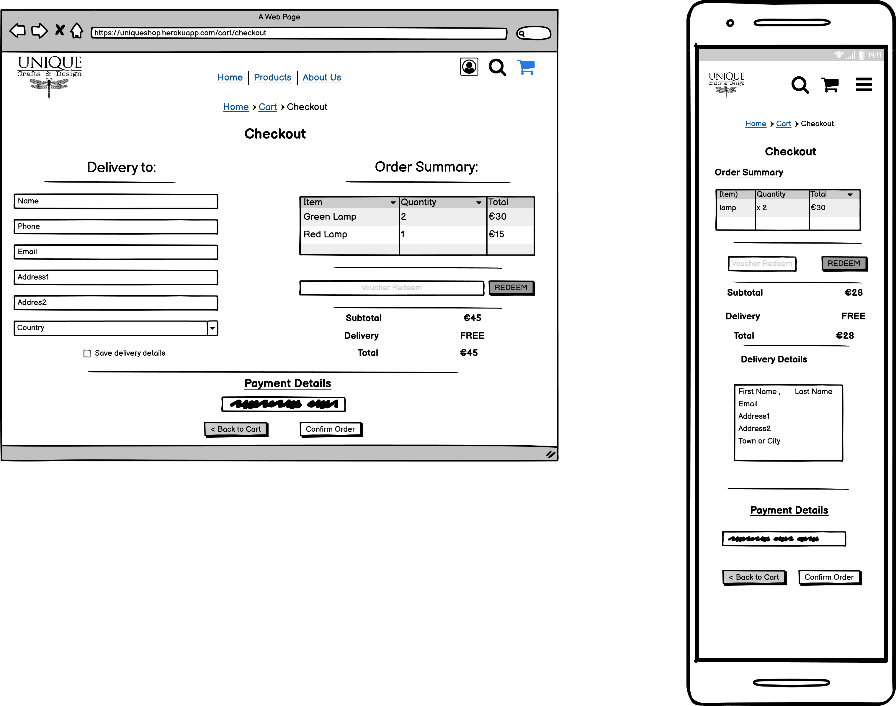

{::options parse_block_html="true" /}
# Unique Shop

This project is an e-commerce website created for Milestone Project 4("Code Institute").
UNIQUE Crafts & Design is a shop selling handcrafted items. Located in Geroge's Street Arcade in Dublin city centre.

:globe_with_meridians:[Live website](https://mn-unique-shop.herokuapp.com/)

:page_facing_up:[GitHub repository](https://github.com/mateuszniechwiej/unique_shop)

# Table of Contest

- [UX](#ux)
  - [The Strategy Plane](#the-strategy-plane)
    - [Project Goal](#project-goal)
    - [Site Goals](#site-goals)
    - [User Stories](#user-stories)
  - [The Scope Plane](#the-scope-plane)
    - [Planed Features](#planed-features)
  - [The Structure Plane](#the-structure-plane)
  - [The Skeleton Plane](#the-skeleton-plane)
    - [Wireframes](#wireframes)
  - [The Surface Plane](#the-surface-plane)
  - [Design](#design)
    - [Colour Scheme](#colour-scheme)
    - [Typography](#typography)
    - [Database Architecture](#database-architecture)
    - [Imagery](#imagery)
- [Features](#features)
  - [Existing Features](#existing-features)
  - [Future Features](#future-features)
- [Technologies Used](#technologies-used)
  - [Languages Used](#languages-used)
  - [Frameworks, Programmes and Libraries](#frameworks-programmes-and-libraries)
- [Testing](#testing)
- [Code Issues](#code-issues)

- [Deployment](#deployment)
  - [Project Initiation](#project-initiation)
  - [Heroku Deployment](#heroku-deployment)
- [Credits](#credits)
  - [Code](#code)
  - [Acknowledgements](#acknowledgements)

# UX

## The Strategy Plane

### _Project Goal_

Unique shop is a full stack e-commerce web application for a handmade craft shop in Dublin.
Customer will be able to purchase items offered by the shop.Registered user will be able to save and update information and receive a discount voucher to use at the checkout.

The aim is to build responsive e-commerce 

### _Site Goals_

- To provide users with a simple and easily navigated website.

- To sell the products the shop has to offer.

- To offer secure online payment for shoppers.

### _User Stories_

1. As a user, I want to understand the purpose of this website.

2. As a user, I want to find an easily navigated website and find all the content.

3. As a user, I want the website to be responsive and allow me to use it comfortably on all size devices(particularly mobiles phones).

4. As a user, I want to find an clear and easy registartion on the website.

5. As a user, I want to receive an email confirmation upon registering.

6. As a user, I want to be able to log in/log out to/from my account.

7. As a user, I want to control my account information and have the option to update my profile details and delete the account.

8. As a user, I want to view individual product information and be able review that item.

9. As a user, I want to view total of my purchases and the final cost including delivery.

10. As a user, I want to have products gruped in categories.

11. As a user, I want to be able to search for the products I'm intrested in.

12. As a user, I want to select quantity of products I'm buying.

13. As a user, I want to be able to contact the site owner for any questions or suggestions I might have.

## The Scope Plane

### _Planed Features_

 1. Users can register.

 2. Allow admin and users to log in.

 3. Allow users to purchase items online.

 4. Allow users to review shop products.

 5. Display users profiles.

 6. Display Users orders.

 7. Search product functionality.

 8. Add and redeem a voucher for users.

 9. Use SQLite database to store information

 10. Responsive website with a navigation menu and website title.

| -   | Planed Feature                                                     | Importance | Viability/Feasibility |
| --- | ------------------------------------------------------------------ | ---------- | --------------------- |
| 1   | Users able to register                                             | 5          | 3                     |
| 2   | Allow admin and users to login                                     | 5          | 3                     | 
| 3   |  Allow user to purches items online     | 5          | 5                     | 
| 4   | Allow user to review shop products            | 4          | 5                     |
| 5   | Display Users profile                                              | 4          | 4                     |
| 6   | Display Users orders                         | 4          | 4                     |
| 7   | Search product functionality                 | 4          | 3                     |
| 8   | Add and reedem voucher for users  | 3          | 5                     |
| 9   | Use SQLite database to store information  | 5          | 4                     |
| 10  | Responsive website with a navigation menu and website title        | 5          | 2                     |

## The Structure Plane

### _Addresing users stories_

> As a user, I want to understand the purpose of this website.

A solution to satisfy user requirements:

- Shop logo in the navigation bar.

- Categories and product links in the header.

- Image carousel showing the main products this shop has to offer.

- Additional information in the footer including about section, social links etc.

> As a user, I want to find an easily navigated website and find all the content.

A solution to satisfy user requirements:

- Top navigation menu in the Header displaying Home, Login, and Registration links.

- Footer at the bottom of the page.

> As a user, I want the website to be responsive and allow me to use it comfortably on all size devices(particularly mobiles phones).

A solution to satisfy user requirements:

- Bootstrap 5 will be used for this website to ensure all content is displayed correctly.

- Collapsible menu when using the website on mobile phones.

> As a user, I want to be able to register to the website. 

A solution to satisfy user requirements:

- registration link available in the navigation bar.

- link to redirect to registration when on the login page.

> As a user, I want to receive an email confirmation upon registering.

A solution to satisfy user requirements:

- confirmation email will be sent once the registration form will be submitted.

> As a user, I want to be able to log in/log out to/from my account.

A solution to satisfy user requirements:

- log in/out links available in the navigation bar menu.

- log in to the link also available on the registration page if the user has already an account.

> As a user, I want to control my account information and have the option to update my profile details and delete the account.

A solution to satisfy user requirements:

- edit and delete buttons available on the account profile page once a user logged in.

> As a user, I want to view individual product information and be able to review that item.

A solution to satisfy user requirements:

- once clicked on the product image, the user will be redirected to a product details page.

- all products can be reviewed once on the product detail page.

> As a user, I want to view the total of my purchases and the final cost including delivery

A solution to satisfy user requirements:

- After adding each item the current total will be visible in the modal.

- information about the total price for items will be available in the shopping cart.

- final cost including shipping fees available at the secure checkout before making the payment.

> As a user, I want to have products grouped in categories.

A solution to satisfy user requirements:

- in the navigation menu user can find categories and all product links.

> As a user, I want to be able to search for the products I'm interested in.

A solution to satisfy user requirements:

- search bar introduce to allow the user to search by categories and product description.

> As a user, I want to select the number of products I'm buying.

A solution to satisfy user requirements:

- users can select the quantity of each item on the product page.

- in the shopping cart user can update the quantity of each product or delete it from the basket.

> As a user, I want to be able to contact the site owner for any questions or suggestions I might have.

A solution to satisfy user requirements:

- contact information in the footer including shop address.

- social links are provided where the user can contact the shop owners.

## The Skeleton Plane

### _Wireframes_

Home

Login

About Us

Account Details

Account Order

Order

Cart

Checkout

Product Details

Register

Review

## The Surface Plane

### Design

#### Colour Scheme

#### Typography

:black_nib:

Fonts used in this project are:

'__Spirax__' with *cursive* as a fallback font to give headlines a refined and interesting look is paired with a simple neutral  '__Open Sans Condensed__' with '*sans-serif*' as fallback.

This combination works well with this shop selling uniquely designed handmade products.

### Differences to design:

### Database Architecture

### Imagery

## Features

### Existing Features

1. Mobile responsive design.
2. Register and login functionality.
3. Profile page with username name and email.
3. Error page to display error messages.

### Future Features

## Technologies Used

### Languages Used

* [HTML5](https://en.wikipedia.org/wiki/HTML5)

* [CSS3](https://en.wikipedia.org/wiki/CSS)

* [JavaScript](https://pl.wikipedia.org/wiki/JavaScript)

* [Python](https://www.python.org/)
    - Python Modules used in this project can be found in the requirements.txt project file)

## Frameworks, Programmes and Libraries
* [JIRA](https://www.atlassian.com/software/jira) - project management tool to organize workflow.
* [Balsamiq](https://balsamiq.com/) - to create wireframes
* [techsini](https://techsini.com/) - to generate website mock-up.
* [dbdiagram](https://dbdiagram.io/) - to create data base diagram.
* [Google Fonts](https://fonts.google.com/) - to import fonts for this site
* [Font Awesome](https://fontawesome.com/) - for social media links and forms icons.
* [Heroku](https://heroku.com) - Heroku was to deploy and host the live website.
* [Visual Studio Code](https://code.visualstudio.com/) - used for developing this website and commit the project to GitHub repository.
* [Chrome Developer Tools](https://developers.google.com/web/tools/chrome-devtools) - used to debug the styling issues, test the website responsiveness and to make sure colour contrast is correct.
* [Github](https://github.com/) - Github as the hosting site was used to store the source code of this website.
* [Git](https://git-scm.com/) - used Git to commit and push code to the GitHub repository.
* [Favicon](https://favicon.io/) - to create a favicon for this Website.
* [Lighthouse](https://developers.google.com/web/tools/lighthouse) - as a part of the chrome dev tool was used to improve the quality of the web page.

## Testing

Testing :point_right: [TESTING.md]

## Code Issues

**Understanding the problem** - 

**Solution** - 

## Deployment

### Local Clone
1. Navigating to the GitHub [Repository](https://github.com/mateuszniechwiej/Climbing-Buddy)
2. Click on Code green button.
3. Under the Clone section, copy the URL from the HTTPS : 

5. Use the IDE of choice to open the terminal.

6. Use git clone command followed by the copied URL.

7. A clone of the project will now be created locally on your machine.

### Create a Virtual Environment(VSCode)
__(You need to have installed Python extensions and Python version 3 before taking following steps )__
1. On the the local system create project folder 
2. In that folder use (for Windows) the command: 
3. Select and activate an environment (To select a specific environment, use the `Python: Select Interpreter` command from the `Command Palette (Ctrl+Shift+P)`.

More info: [VSCode docs](https://code.visualstudio.com/docs/python/environments#_select-and-activate-an-environment)

### Heroku Deployment

## Credits
[codepen](https://codepen.io/michalwyrwa/pen/GBaPPj) - back to the top button.
[codepen](https://codepen.io/designcouch/pen/Atyop) - hamburger icon
[stackoverflow](https://stackoverflow.com/questions/5895588/django-multivaluedictkeyerror-error-how-do-i-deal-with-it)- multiselect value
[Twilo](# https://www.twilio.com/blog/build-contact-form-python-django-twilio-sendgrid)-learn how to built contact form

### Code

## Acknowledgements