# Testing Documentation

This website is for Milestone Project 4.

Built with HTML, CSS, JavaScript and Python Django.

To go back to README :point_right: [README.md](README.md)

# Table of Contest

1. [Testing Plan](#testing-plan)

2. [Validation Test](#validation-test)

3. [Responsive Test](#responsive-test)

4. [Manual Test](#manual-test)

5. [Code Issues](#code-issues)

# Testing Plan

Testing required:

* code must pass the HTML, CSS, JS and python(PEP8) Validators

* responsiveness of all elements on all pages(both for logged and logged out users)

* links on pages must work properly and redirect to correct pages.

* updating cart

* Stripe payment functionality

* Webhooks test

* Registration functionality

* Contact form sending message to site admin

* Profile page with orders history

* Error testing

* Console errors

* favicon present

# Validation Test

## HTML Validator - Test

Naviagate to HTML Validator - [W3C HTML Validator](https://validator.w3.org/) - PASS

* Home page

 1. Select Validate by Url and paste https://mn-unique-shop.herokuapp.com/ - PASS

 2. Click `Check`  - PASS

 3. Result displayed: 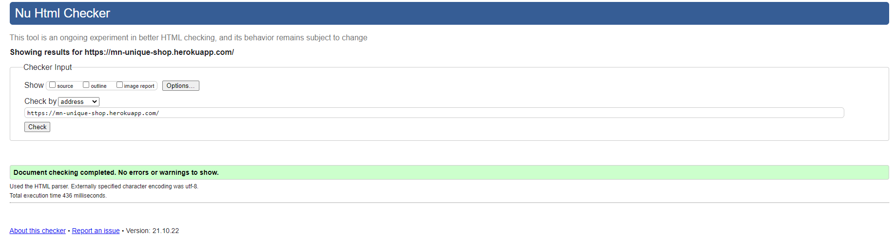

Follow the same steps for: 

* products

    * Url: https://mn-unique-shop.herokuapp.com/products - PASS

    * Result : 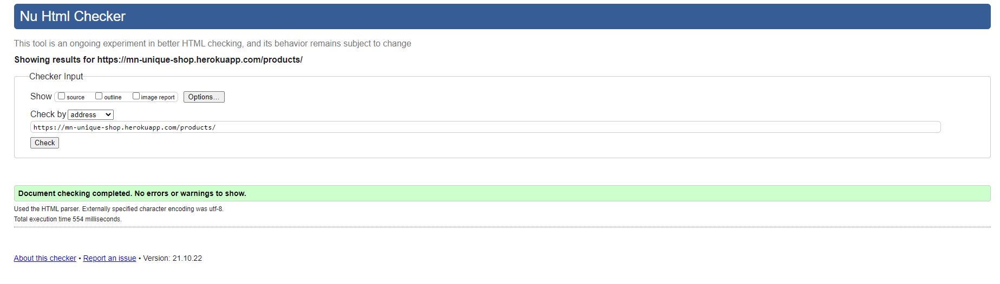

* Contacts

    * Url: https://mn-unique-shop.herokuapp.com/contact/ - PASS

    * error:

    `Stray end tag main: 
↩</main>↩<foot`

    * Fix issue and `git commit <Fix: message>` and `git push`

    * Reapeat test

    * Result: 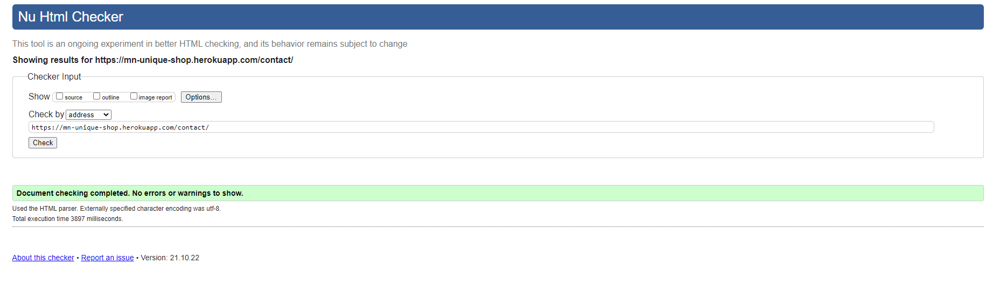

* Signup

  * Url: https://mn-unique-shop.herokuapp.com/accounts/signup/

  * Result: PASS

* Login

 * Url: https://mn-unique-shop.herokuapp.com/accounts/login/

 * error: 

    `Stray end tag div: /div>↩    
↩↩ `

* Fix the issue and `git commit <Fix: message>` and `git push`

* Repeat test

* Result:

## CSS Validator - Test

Navigate to CSS Validator - [W3C CSS Validator](https://jigsaw.w3.org/css-validator/) - PASS

* base.css

 1. Copy and Paste the CSS code from base.css in the project files in the By direct input tab and click Check

2. Result:
    

* toggler.css

 1. Copy and Paste the CSS code from toggler.css in the project files in the By direct input tab and click Check

 2. Result:

    

* checkout.css

 1. Copy and Paste the CSS code from toggler.css in the project files(checkout/static) in the By direct input tab and click Check

 2. Result:

    

## JavaScript Validator - Test 

Navigate to JS Validator  - [JSHint Validator](https://jshint.com/) - PASS

* base.js file

 1. Copy and paste base.js file

 2. Result:

 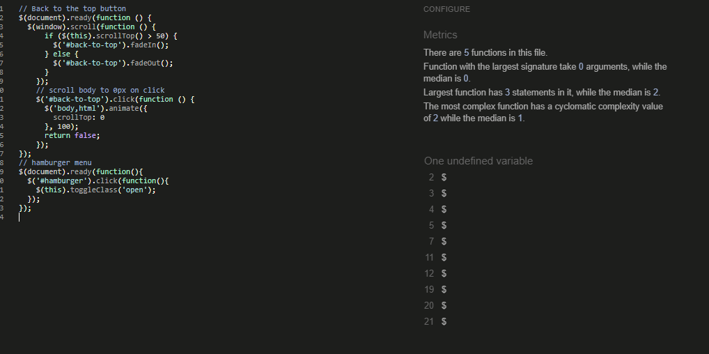

* stripe_elements.js

 1. Copy and paste stripe_elements.js file

 2. Result: Pass

 Comment: Showing 2 undefined variables Stripe 

For toasts messages javascript code:

1. Copy and paste js code from the base template

2. Result: PASS

For preventing form to resubmit review:

1. Copy and paste js code from product_details template

2. Result: PASS

## Python PEP8 Validator - Test

Navigate to [PEP8 Validator](http://pep8online.com/) - PASS

For cart:

1. Copy and paste code from :

    * admin.py - PASS

    * contexts.py - PASS

    * models.py - PASS

    * test.py - PASS

    * urls.py - PASS

    * views.py - PASS

2. Result: PASS on all files

For checkout:

1. Copy and paste code from :

    * admin.py - PASS

    * forms.py - PASS

    * models.py - PASS

    * signals.py

    * test.py - PASS

    * urls.py - PASS

    * views.py - PASS

    * webhook_handler.py - PASS

    * webhooks.py - PASS    

2. Result: PASS on all files

For contact:

1. Copy and paste code from :

    * admin.py - PASS

    * forms.py - PASS

    * models.py - PASS

    * test.py - PASS

    * urls.py - PASS

    * views.py - PASS

2. Result: PASS on all files

For home:

1. Copy and paste code from :

    * admin.py - PASS

    * models.py - PASS

    * test.py - PASS

    * urls.py - PASS

    * views.py - PASS

2. Result: PASS on all files

For products:

1. Copy and paste code from :

    * admin.py - PASS

    * forms.py - PASS

    * models.py - PASS

    * test.py - PASS

    * urls.py - PASS

    * views.py - PASS

2. Result: PASS on all files

For profiles:

1. Copy and paste code from :

    * admin.py - PASS

    * forms.py - PASS

    * models.py - PASS

    * test.py - PASS

    * urls.py - PASS

    * views.py - PASS

2. Result: PASS on all files

For unique_shop:

1. Copy and paste code from :

    * urls.py - PASS

    * settings - Comment:

    Errors for auto-generated fields:

    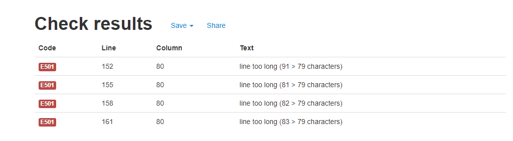

2. Result: PASS on all files

Python files in the main directory:

1. Copy and paste code from :

    * custom_storages.py - PASS

    * manage.py

2. Result: PASS on all files

# Responsive Test

|Screen size\Browser |Chrome            |Opera             |Edge              |Firefox           |Safari            
|--------------------|------------------|------------------|------------------|------------------|------------------| 
|Mobile              |:white_check_mark:|:white_check_mark:|:white_check_mark:|:white_check_mark:|:white_check_mark:|
|Tablet              |:white_check_mark:|:white_check_mark:|:white_check_mark:|:white_check_mark:|Not Tested        |
|Desktop             |:white_check_mark:|:white_check_mark:|:white_check_mark:|:white_check_mark:|:white_check_mark:|

The website was tested on a varied number of devices:

### For Mobiles:

* Android - Samsung Galaxy S10 (screen size - 6.1-inch) on Chrome, Opera, Firefox and Microsoft Edge

* IOS - iPhone 7 (screen size - 4.7-inch) on Safari and Chrome

* IOS - iPhone Pro 12 (screen size 6.1-inch) Safari and chrome

### For Tablet:

* Surface Book in tablet view - Chrome, Opera, Firefox, Edge (screen size - 13.5- inch)

### For Desktop:

* PC Windows (Windows 10):

  1. Surface Book on (screen size - 13.5-inch)

  2. Surface Book on the second monitor DELL U2419H(screen size - 24-inch)

  3. Huawei mate book D15(screen size 15.6-inch)  

  Tested on  Chrome, Opera, Firefox and Microsoft Edge

* MacBook pro 13:

  * Tested on Safari and Chrome browser.

Friends and family were asked to test this website. After receiving feedback from them some minor responsive issues were addressed like increment and decrement value not visible on mobile screens below 400px.

Test responsiveness of website on all screen sizes using Chrome browser: 

Steps taken:

 1. In google chrome browser go to http://mn-unique-shop.herokuapp.com/

 2. Right-click on the page content and inspect

 3. Click and drag the responsive window down to 300px and up to max 2400px. 

 4. Repeat on all site pages.

Comments: The shopping cart responsiveness issue below 340px was noticed and fixed.

# Manual Test

### Navbar links:

Steps:

- Navigate to http://mn-unique-shop.herokuapp.com/

- Checking all links working - PASS

- All links for logged out users tested - PASS 

- All links for not logged user-tested - PASS

- Checking if relevant links are visible for logged in and logged out users - PASS

Repeat steps on all pages - PASS

### Buttons links and CSS:

    Checking if relevant buttons from all pages working and redirecting a user to the correct page - PASS

    Checking if CSS on buttons for colours and hover effect - PASS

### Footer:

    Checking if the footer is sticking to the bottom on the relevant pages - PASS

### Content:

    Checking on each site if relevant content is displayed for all pages.

- For logged-in users - PASS

- For not logged users - PASS

## Cart

### Adding to cart

    Checking if correct items are added to the shopping cart:

Steps:

- Navigating to http://mn-unique-shop.herokuapp.com/products

- Selecting product without colour and adding to cart - PASS

- Checking if correct toast message is displayed - PASS

- Value bellow basket icon in navbar added correct value - PASS

- Clicking on the cart and checking if an item is in the cart - PASS

- Repeating this process for items with different colours and adding them to the cart - PASS

### Updating cart

- after updating the correct toast message displayed - PASS

- the total and grand total of the product change accordingly - PASS

- the number of items was updated correctly - PASS

- delete an item from shopping cart working and toast message displayed correctly - PASS

## Stripe payment functionality

- add available products to the cart - PASS

- navigate to cart - PASS

- proceed to checkout - PASS

- check the delivery address(saved during registration and showing on delivery information) - PASS

 - also check for the user not saving address - address not showing - PASS

- put testing card number : 

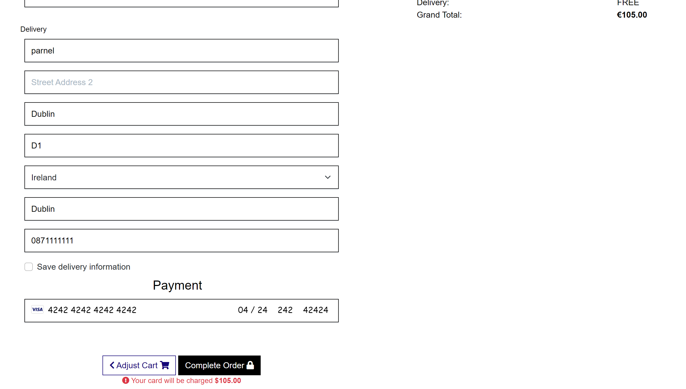

- complete checkout - PASS

- Success toast message displayed 

### Webhook test :

- on vs code before deploying to Heroku: - PASS

- webhook test after deploying to Heroku: - PASS

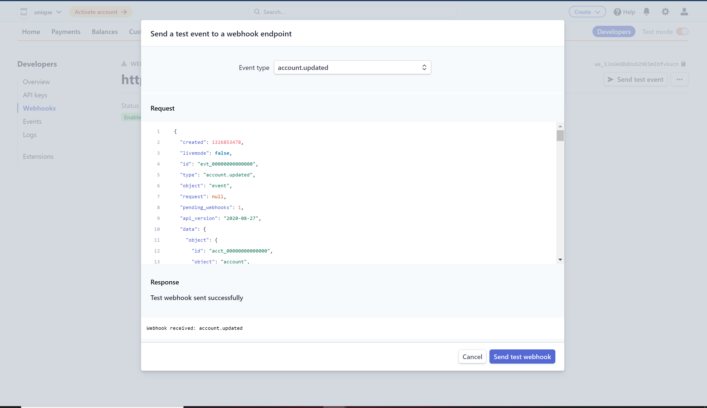

## Registration test

- on home page click user icon in navbar - PASS

- click register - PASS

- fill information and sign up - PASS

- confirmation email sent to YOUR email address - PASS

- 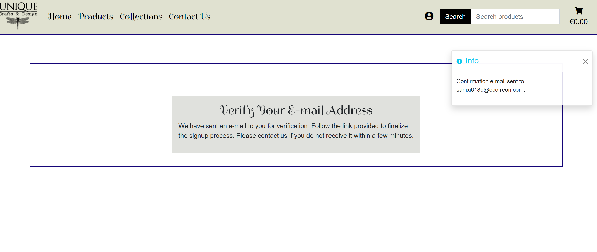

- Once receeived confirm Email - PASS

- 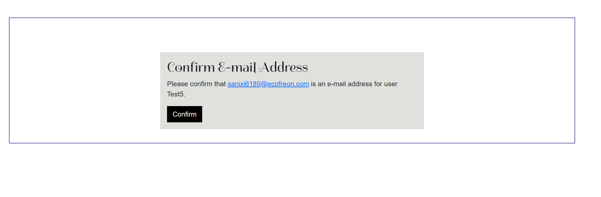 

- Succes toast messsage displaying registration completed - PASS

## Login test

- click user on navbar - PASS

- type your email and password and login - PASS

- toast success message displaying - PASS

### Reset password

- when login choose forgotten password - PASS

- type your email - PASS

- after receiving an email change the password - PASS

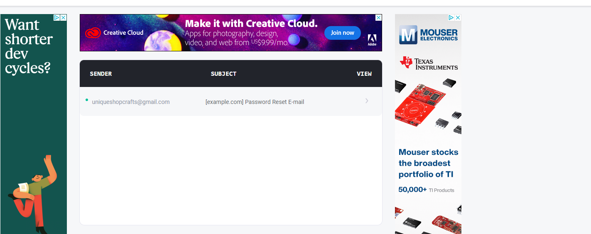

- change your email - PASS

- login again - PASS

## Contact form

- navigate to contact page - PASS

- fill the form and submit - PASS

- navigate to Django admin - PASS

- Go to Contacts - PASS

- check all messages are correct - PASS

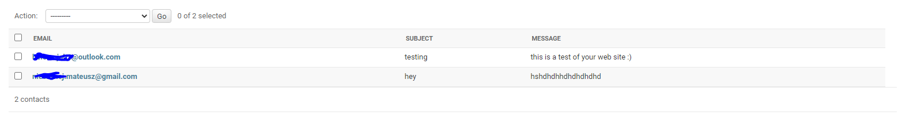 

## Profile page with orders history

- after loge in go to user profile - PASS

- check address match the one selected to save - PASS

- select one of the previous orders - PASS

- toast info message displayed - PASS

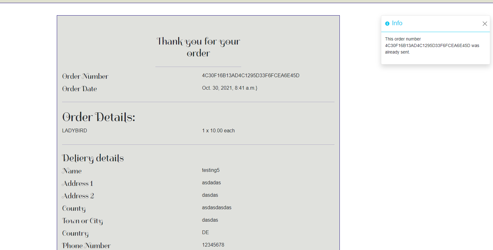

## Errors test

For error 404:

- Navigate to https://mn-unique-shop.herokuapp.com/error  - PASS

- error page 404 displayed - PASS

For error 500:

 -template working - PASS

## Console test

- inspect page - PASS

- and in developer tools go to Console - PASS

- check messages - PASS

### favicon 

- ensure favicon presented on all pages - PASS

## Code Issues

1. During development I notice the mistake of not hiding secret keys in setting.py 

**Understanding the problem** 

environment variables were exposed to all users and available to read in the GitHub repository

**Solution**

- generated new secret keys for Django and Cloudinary
- installed Django dot-env
- store secret keys in the .env file
- add `.env` to `.gitignore`

2. Encoding issues when trying to upload JSON DB data to Postgres

**Understanding the problem** 

 It seems I was trying to decode the utf-16 encode file with utf-8 codes

**Solution**

Edited unknown characters and upload data to Postgres DB

3. Error when trying to add an item without the colour to the shopping cart
MultiValueDictKeyError

**Understanding the problem** 

All items needed to have a value for the colour

**Solution**

Add default value for color variable:
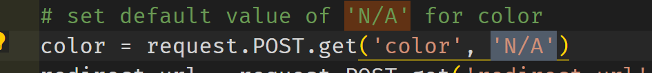

4. Reviews added on page refresh

    **Understanding the problem**

    The form was resubmitting user review

    **Solution**
    Added js script to prevent that behaviour
    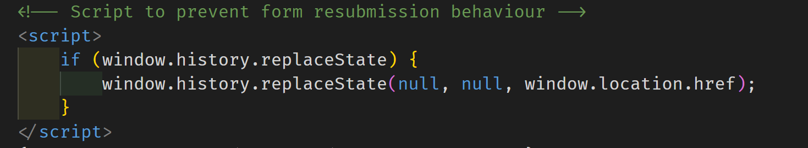

5. Logo redirect link not working

**Understanding the problem**

Not used Django template language for image src.

**Solution**

Change image src to ``

6. Back to top button covered with products cards

**Understanding the problem**

z-index was higher for product cards

**Solution**

Set z-index for `back-to-top-button` to 999
